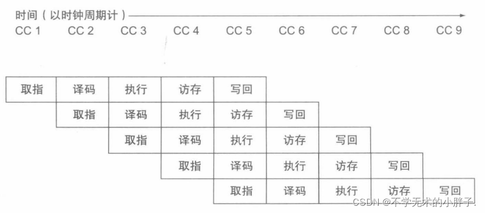
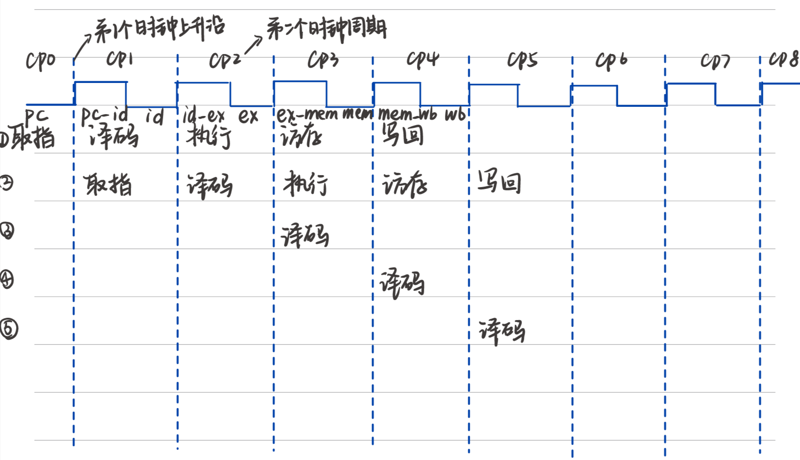

## 流水线冒险

[toc]

### RISCV

这是一个支持 RV32I 指令的 riscv cpu, 采用五级流水线结构：

取指 译码 执行 访存 回写

### 流水线冒险的分类

#### 结构冒险

一般是由于硬件不支持多条指令在同一时钟周期引起的硬件冲突问题，目前我们设计的流水线结构暂时不会涉及到这种情况。

#### 数据冒险

流水线机制中，当一条指令的执行结果还没有写回寄存器而后面的指令要使用前者目标寄存器的值的时候，就会发生数据冒险。

#### 控制冒险

在遇到条件分支指令时，由于跳转条件是否成立在执行阶段才知道，因此流水线就需要停顿或者冲刷指令才能正确运行。

### 数据冒险



#### 情况 1，2，3

执行以下四条指令

```
addi x1,x0,1
addi x2,x1,1
addi x3,x1,2
addi x4,x1,3
```


解决办法：**数据前移**，上面讨论的三种冒险的情况有一个共同点，就是在执行阶段结束的时候，带写回 X1 的结果就已经知道了，所以我们可以通过将数据前递解决冒险。在 ex 执行前新增一个 module，实现三选一数据选择器。写寄存器使能信号有效时，将 id_ex 所访问的地址和 ex_mem 执行的地址,mem_wb 写回的地址相比较，如果相同，则将前面的数据通过三选一数据选择器进入执行阶段。

#### 情况 4

```
lw x1,0,x0
addi x2,x1,1
addi x3,x1,2
addi x4,x1,3
```

与前面三种情况不同的是
现在面对的是访存指令，**访存指令的结果要在访存结束后才能知道**。

对于第二条指令来说，第二条指令处在译码阶段的时候，第一条指令处在执行阶段，第二条指令进入执行阶段时，第一条指令才刚刚进入访存阶段，还没有来的及读出待写回 X1 的值。**数据前移的方法失效**只能通过等待一个时钟周期，等第一条指令访存阶段结束后，再进行数据前递。
解决方法：第一条指令在执行阶段给 ctrl 输出一个停顿信号，实现插入一条空指令的功能，在控制冒险中解决。
对于第三条和第四条指令，则不需要额外修改，之前的数据前递的方法仍然有效。

#### 情况 5

```
lw x1,0,x0
sw x0,0,x1
lw x2,0,x0
sw x2,1,x0
```

#### 总结

a.在一个周期开始，EX 阶段要使用上一条处在 EX 阶段指令的执行结果，此时我们将 EX/MEM 寄存器的数据前递。
b.在一个周期开始，EX 阶段要使用上一条处在 MEM 阶段指令的执行结果，此时我们将 MEM/WB 寄存器的数据前递。
c.在一个周期开始，EX 阶段要使用上一条处在 WB 阶段指令的执行结果，此时不需要前递（寄存器堆前递机制）
d.在第一种情况下，如果是上一条是访存指令，即发生加载—使用型冒险。则需要停顿一个周期。
e.在发生加载——使用型冒险的时候，如果是 load 后跟着 store 指令，并且 load 指令的 rd 与 store 指令的 rs1 不同而与 rs2 相同，则不需要停顿，只需要将 MEM/WB 寄存器的数据前递到 MEM 阶段。

### 控制冒险

对于控制冒险，也主要有三个解决办法：硬件阻塞、软件 NOP 和分支预测技术(Perdict)。

#### 分支预测技术

分支预测技术也大致分为**静态分支预测**和**动态分支预测**，前者总是假设跳转条件不满足，继续向后取指，跳转结果得出后若需要跳转再使这部分指令失效即可。

#### 冲刷流水线（执行遇跳转信号）

#### 停顿流水线（遇到加载-使用型冒险）
